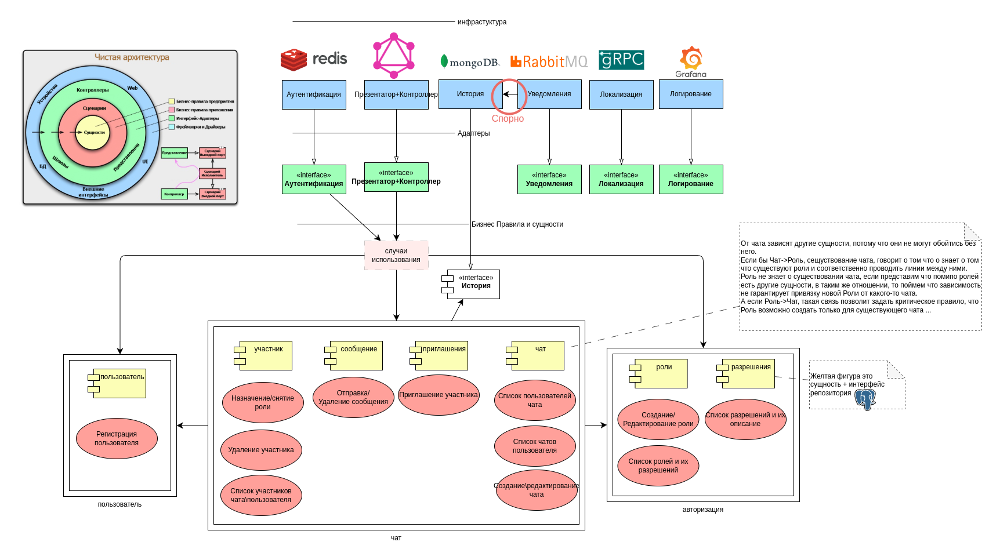
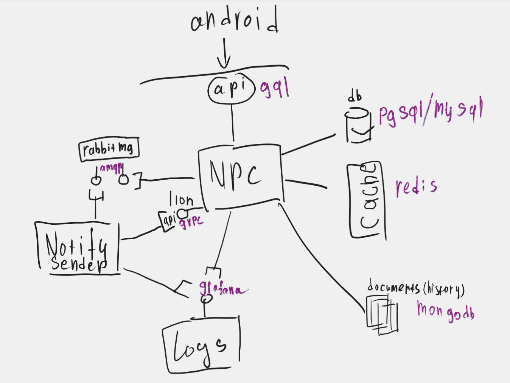
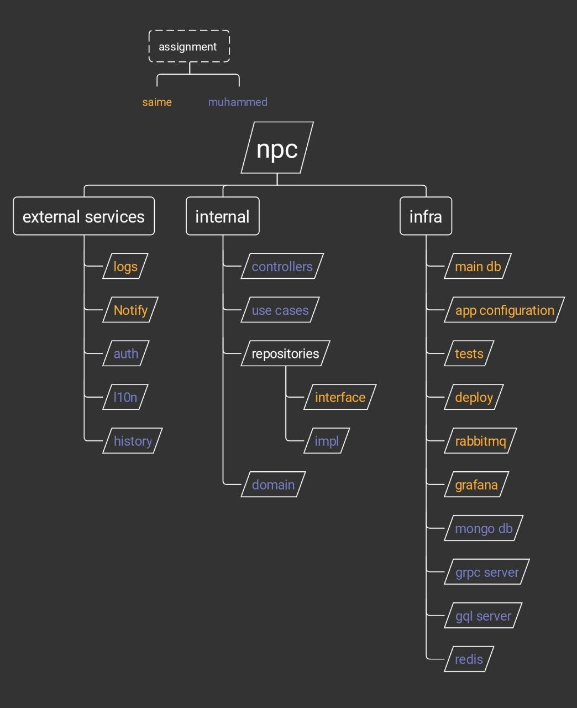

# Компоненты v2

⚠️  27 марта 2025: Документ больше не ведется

# Компоненты v1

[Доска в microsoft whiteboard](https://wbd.ms/share/v2/aHR0cHM6Ly93aGl0ZWJvYXJkLm1pY3Jvc29mdC5jb20vYXBpL3YxLjAvd2hpdGVib2FyZHMvcmVkZWVtLzE1NWZlNzM2MzA2NTRhOWNhYTQ0MDQwNzRhNmRhNjlmX0JCQTcxNzYyLTEyRTAtNDJFMS1CMzI0LTVCMTMxRjQyNEUzRF9jZmZlYTQzYS03MmU4LTQxNDItODRmNi01Y2VlOWM5ZjVjMzI=) 

android - мобильное приложенение на kotlin, код лежит в общем репозитории npc

api(gql) - graphql api для мобильного клиента, предоставляемое приложением NPC

NPC - golang приложение, сервер с двумя эндпоинтами, api - для мобильного клиента и l10n - для использования локализации в других сервисах

[l10n](https://wp-yoda.com/adaptacziya-programmnyh-produktov/otlichiya-i18n-i-i10n/) (grpc) - grpc api для локализации, это внутренний компонет NPC, к которому предоставляется доступ для внешних сервисов, по средствам grpc

rabbitmq ([amqp](https://www.rabbitmq.com/tutorials/amqp-concepts)) - брокер сообщений, в который NPC будет помещать задачи на рассылку push-уведомлений, а сервис notify рассылать 

notify sender - сервис рассылки push-уведомлений

logs (grpc) - grpc api для записи в 

logs (grafana loki) - сервис для просмотра и управления логами. В приложениях же логирование будет с помощью [slog](https://habr.com/ru/companies/slurm/articles/798207/)

db (pgsql/mysql) - основная база данных для npc, будут храниться как данные предметной области, так локализация и другие необходимые данные 

cache (redis) - кэш для хранения активных сессий, rate-limit, черновых записей(сообщение для отправки например) и других данных, которые хранятся не долго и потерять их не страшно

documents (mongodb) - хранилище истории действий пользователей

# Зоны ответственности

⚠️  27 марта 2025: Документ больше не ведется

**NPC** - главный компонент с бизнес логикой, можно сказать core

**external services** - подкомпоненты (составляющие), которые могут представлять из себя:
- независимый golang пакет или модуль (в отдельном или том же репозитории);
- связку: service <-> api <-> adapter(в виде пункта выше);

**internal** - основные слои реализующие логику

**infra** - обвязка приложения

**logs (service-api-adapter)** - логирование в приложении из npc с slog, и отправка логов в grafana loki для мониторинга.

**notify (service-api-adapter)** - отправка пуш уведомлений из npc с помощью amqp, и обработка задач независимым сервисом.

**auth** - аутентификация пользователей с помощью access(или jwt) и refresh токенов, управление активными сессиями.

**l10n** - локализация строк, ошибок. В npc реализовать с помощью независимого пакета, который хранит локализацию в БД.

**history** - история действий пользователей (вошел\вышел\добавил\удалил\изменил\кикнул\перенес), тех операций которые не фиксируются в БД(напр. сообщения).

**controllers** - api эндпоинты - gql\grpc обработчики, внутри будут вызываться usecases.

**usecases** - функции или методы, выполняющие одно логическое действие(удалить роль, создать чат, отправить приглашение в чат, и т.п).

**repositories** -  функции или методы, выполняющие один или несколько запросов в БД, для получения или изменения данных.

**domain** - модели (структуры).

**main db** - основная БД и её схема, миграции, конфигурация, подключение в коде.

**app configuration** - способ получения конфигурации приложением.

**tests** - написание тестов для реализации функционала (TDD).

**deploy** - настройка отправки кода на сервер и обновления работающего приложения.

**rabbitmq** - настройка amqp и подключение к нему в коде.

**grafana** - настройка логировния через grafana и подключение к ней в коде.

**mongo db**  - настройка mongo  и подключение к нему в коде.

**grpc server** - protobuf схема и генерация кода по ней.

**gql server** - graphql схема и генерация кода по ней.

**redis** - настройка redis  и подключение к нему в коде.

# Последовательность реализации

⚠️  27 марта 2025: Документ больше не ведется

### Подготовка

Посмотреть существующий ui 

Вспомнить что хотим изменить

Набросать примерные модели данных с учетом изменений

Набросать примерный api с учетом изменений

Сделать правки в ui с учетом изменений

Составить требования на основе ui, модели данных, api

Описать пробную gql схему, попытаться реализовать требования

### Раздел 1

Описать usecases в коде

Описать модели в коде

Описать репозитории в коде

Написать тесты согласно требованиям

### Раздел 2

Написать схему главной БД

Выбрать инструменты для возможности применять миграции к БД

Предоставить инструкцию по подключению к БД

Предоставить инструкцию по миграции БД

### Раздел 3

Выбрать способ конфигурации приложения

Реализация конфигурации в коде

Предоставить инстркцию по дополнению конфигурации

Предоставить инструкцию по конфигуации сервера

### Раздел 4

Выбрать способ логирования об ошибках, варнингах, информационных сообщениях …

Настроить графану локи 

Предоставить инструкцию по логированю

### Раздел 5

Выбрать способ реализация l10n

Реализовать l10n

Написать grpc схему для  l10n api

Реализация grpc контроллера для l10n 

Предоставить инструкцию по использованию l10n 

Предоставить инструкцию по использованию l10n api 

### Раздел 6

Сгенерировать код npc api по ранее описанной gql схеме

Реализовать обработчики npc api

Предоставить инструкцию по подключению к graphql playground (npc api)

### Раздел 7

Описать методы history

Настроить mongodb

Реализовать history

Предоставить инструкцию по использованию history

### Раздел 8

Выбрать способ аутентификации пользователей

Настроить redis

Реализовать аутентификацию

Предоставить инструкцию по аутентификации

### Раздел 9

Описать методы notify sender

Настроить rabbitmq

Реализовать notify sender

Предостаавить инструкцию по использованию notify sender

### Раздел 10

Выборать способ отправки и обновления приложения на сервере

Реализовать деплой

Предоставить инструкцию по деплю